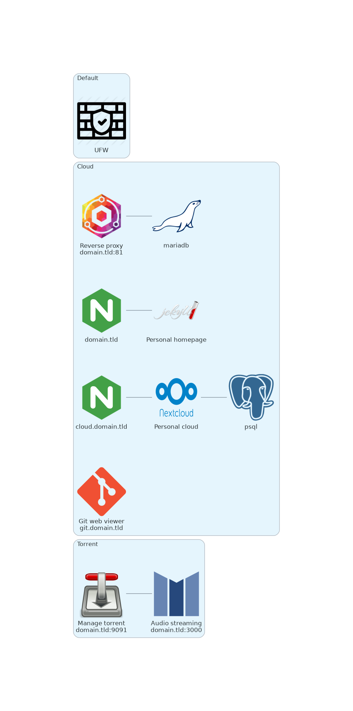

# Self-hosted


## Requirements

The following packages have to be installed to run the whole project:

- On host:
	- `ansible`: deploy a module to the target machine
	- `yq`: parse config
	- for testing purposes (optional):
		- `vagrant` + `libvirt`: deploy on localhost
		- `terraform` + `aws-cli` + `gandi`: deploy on AWS and set CNAME

- On target:
	- `python3` (Ansible requirement)
	- a sudo-able user

The architecture consists yet of the following components:

- Cloud module:
	- Nginx+TLS reverse-proxy, it handles subdomains and routing to containers
	- personal homepage, managed by a Jekyll container (`domain.tld`)
	- NextCloud instance (`cloud.domain.tld`)
	- git viewer, Klaus (`git.domain.tld`)
- Torrent module:
	- Transmission to manage the torrents (domain.tld:9091)
	- music streaming with mStream (`domain.tld:3000`)




## Configuration

A sample configuration is available at `./conf/config-sample.yml`.
Copy to `./conf/config.yml` and adapt to your setup.

The git repositories are at `/home/git` by default, this allowing to clone the repositories this way:

```sh
git clone git@domain.tld:repo.git
```

Or, using Klaus URL:

```sh
git clone https://git.domain.tld/repo.git
```

The Jenkins input files are stored at `/tmp/www` by default.
In my case, they are located at `/home/git/.website-clone` as the sources are in the same directory (but as a bare repository).
Using the default value without at least `index.html` being present in the default directory may result in an error (likely 404).

About the production deployment, the config file should provide an array of `(url, modules)` pairs like the example below.
Note that the `default` playbook is run before any other module.

```yml
- url: domain.tld
  modules:
    - cloud
- url: myrpi3
  modules:
    - torrent
```


## Running

> By default, all the docker volumes are located in `/mnt`.
> You may want to backup this directory.

At first, get the sources:

```sh
git clone https://git.franzi.fr/self-hosted
```

As just shown abose, this project is designed around modules (Ansible playbooks).
Before running the project, set the production architecture in the config file.

Once finished, use `./utils/manage` to deploy it.

> /!\ on local host and AWS, the following script runs the `debug` playbook.
> It can be set off by running the `default` playbook again.

```
./manage help:
    deploy
      local  deploy on localhost using vagrant and libvirt
      aws    deploy on aws using terraform and set cname on gandi
      prod   deploy on production
    destroy  local | aws | prod | all
    ssh      local | aws | prod
```


## Security


### System

A [firewall](https://wiki.archlinux.org/title/Ufw) is deployed, it only accepts connections on:

- HTTP
- HTTPS
- SSH (restricted)

Connections on port 80 are redirected to the SSL version using Let's Encrypt certificates.
The other ports are blocked by the firewall and only accessible in the local network.

The SSH configuration should be customized to only allow pubkey authentication.

Add keys to the git user in the `/home/git/.authorized_keys`, and create repositories using `git-shell` commands.


### Apps

The applications run in docker containers dispatched over related-only networks (`proxy`, `app1`, `app2`, etc).
About passwords, please use long passwords with both letters, digits and special characters.


## TODO

- use Traefik instead of NPM
- setup Wireguard + PiHole
- Podman?
