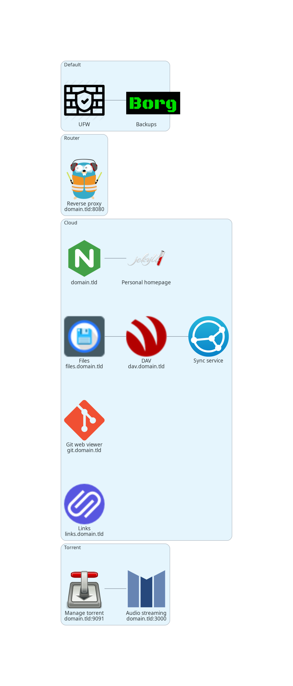

# Self-hosted


## Requirements

The following packages have to be installed to run the whole project:

- On host:
	- `ansible`: deploy a module to the target machine
	- `yq`: parse config
	- for testing purposes (optional):
		- `vagrant` + `libvirt`: deploy on localhost
		- `terraform` + `aws-cli` + `gandi`: deploy on AWS and set CNAME

- On target(s):
	- `python3` (Ansible requirement)
	- a sudo-able user

The architecture consists yet of the following components:

- Router module:
	- Traefik as a reverse-proxy, it handles subdomains and routing to containers
- Cloud module:
	- personal homepage, managed by a Jekyll container (`domain.tld`)
	- git viewer, Klaus (`git.domain.tld`)
	- links manager, Linkding (`links.domain.tld`)
	- Cal/CardDAV server, baikal (`dav.domain.tld`)
	- filebrowser (`files.domain.tld`)
	- files synchronisation using Syncthing
- Torrent module:
	- Transmission to manage the torrents (`domain.tld:9091`)
	- music streaming with mStream (`domain.tld:3000`)




## Configuration

A sample configuration is available at `./conf/config-sample.yml`.
Copy to `./conf/config.yml` and adapt it.

The git repositories are at `/mnt/git` by default, this allows to clone the repositories this way, using the `git` user:

```
git clone git@domain.tld:repo.git
```

Or, using Klaus URL:

```
git clone https://git.domain.tld/repo.git
```

The Jenkins input files are stored at `/var/www` by default.
In my case, they are located at `/mnt/git/.website-clone` as the sources are in the same directory (but as a bare repository).
Using the default value without at least `index.html` being present in the default directory may result in an error (likely 404).

About the production deployment: the config file should provide a list of `(url, ip, modules)` tuples like the example below.
Note that the `default` playbook is run before any other module (so no need to add it manually).

```yml
- url: domain.tld
  ip: 12.34.56.78
  modules:
    - cloud
- url: myrpi3
  ip: 87.65.43.21
  modules:
    - torrent
```

The backup server is setup on the machine specified in the `backup_server` variable.

It is possible to deploy the `router` mmodule on multiple servers, so each machine handles a specific subdomain.


## Running

> By default, all the docker volumes are located in `/mnt` on each server.
> The backups are done by Borg, see [here](#backups).

At first, get the sources:

```
git clone https://git.franzi.fr/self-hosted
```

As just shown above, this project is designed around modules (Ansible playbooks).
Before running the project, set the production architecture in the configuration file.

Once finished, use `./utils/manage` to deploy it.

> /!\ on local host and AWS, the above script runs the `debug` playbook.
> It can be set off by running the `default` playbook again.

```
./manage help:
    deploy
      local  deploy on localhost using vagrant and libvirt
      aws    deploy on aws using terraform and set cname on gandi
      prod   deploy on production
    destroy  local | aws | prod | all
    ssh      local | aws | prod
```

When using the AWS environment, the `manage` script can receive more arguments in order to specify which playbooks to run.
I.e. `./manage deploy aws cloud torrent`.
If none are given, it will run all the available playbooks.


## Post-installation

Sadly, some services still require some post-installation steps, such as setting up credentials.


### Cloud :: web

The Web builder watches for modifications in the directory specified in the `web_files` variable.
By default, this directory is `/srv/www` which is empty.
In my case, I set this value to `/mnt/git/.website-clone` which is a clone of the eponym repository.

Once I setup the whole project, I have to do the following steps:

```sh
cd /mnt/git
git clone ./website ./.website-clone
```


### Cloud :: sync

The Sync service, implemented by Syncthing, requires too some manual steps.
First, forward the GUI port on the local machine:

```sh
ssh -NL 8384:localhost:8384 "$(yq -r '.main_user' "$CONF")@$(yq -r '.hostname' "$CONF")"
```

Now, visit `http://localhost:8384` and set everything up.
This means:

- (optional) setup GUI credentials
- add other devices
- configure synced folders

> Note that the `/data` folder inside the container is a mount from `/mnt/data` on the host.
> This means that the synced folders must be in this folder otherwise they will get destroyed if the container is removed.


### Cloud :: files

The same goes for the files browser.
Visit `https://files.domain.tld` and login using `admin:admin`.

Now go to the settings, change the default administrator password.
Add another user, one can restrict its scope to restrict it to desired folders.
It can be useful if multiple users are defined.


### Cloud :: dav

Same, but this time the administrator password has to be setup when visiting for the first time.
Go to `https://dav.domain.tld`, and follow the wizard.
Then navigate to the settings and add the desired user.


### Cloud :: links

Last one, visit `https://links.domain.tld`.
The credentials are `linkding:<password>` with the password specified in the configuration file.

Add another user, and let's go!


## Security


### Backups

Backups are enabled on all the servers specified in the configuration file.
The server is configured in the `backup_server` variable.

Then, on each client, Borgmatic is enabled to perform Borg backups everyday.

On the backup server, the repositories are under the `backup` user home directory (`/home/backup`), each machine having its own restricted sub-directory.

> The users `root` and `backup` have to be setup by hand.
> This means, run `passwd <user>` and `passwd -u <user>` for both of them or SSH connection will fail.


### System

A [firewall](https://wiki.archlinux.org/title/Ufw) is deployed, it only accepts connections on:

- HTTP
- HTTPS
- SSH (restricted)
- Syncthing: 22000 & 21027/udp

Connections on port 80 are redirected to the SSL version using Let's Encrypt certificates.
The other ports are blocked by the firewall and only accessible in the local network.

The SSH configuration should be customized to only allow public-key authentication.

Add keys to the git user in `/mnt/git/.authorized_keys`, and create repositories using `git-shell` commands.


### Apps

The applications run in docker containers dispatched over related-only networks (`proxy`, `app1`, `app2`, etc).
About passwords, please use long passwords with both letters, digits and special characters.


## Notes

On Android, most of the pictures are stored in the following directories.
It can be some folders to keep syncthing-ed.

- /storage/emulated/0/DCIM
- /storage/emulated/0/Pictures
- /storage/emulated/0/Movies
- /storage/emulated/0/Android/media/com.whatsapp/WhatsApp/Media
- /storage/emulated/0/WhatsApp/Media

They can be configured as *Send only*.


## Bugs

- `./playbooks/backup-client.yml:29: --encryption none`
- `./playbooks/backup-server.yml:11: FIXME key_options`


## TODO

- [X] use Traefik instead of NPM
- [X] real bkp module with borg on each machine
- [X] add a links (bookmarks manager)
- [X] replace nextcloud, see baikal+filebrowser+syncthing
- [ ] arrange hostnames management (TF with Gandi provider as we have IP/URL in config file?)
- [ ] arrange the `conf` directory to not deploy/save it everywhere (split it in `conf`/`assets` dirs?)
- [ ] setup Wireguard + PiHole
- [ ] rename 'torrent' to 'media' and use the *arr stack instead
- [ ] add the torrent sorting script (but as another module?)
- [ ] Podman?
